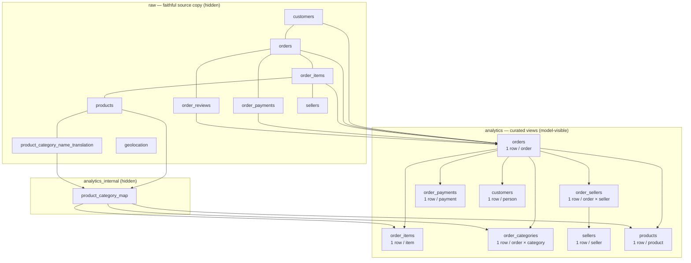

# Data model

The Olist dataset loads into a faithful `raw` schema. A curated `analytics` schema on
top of it is the only thing the NL-to-SQL model will ever see
([ADR 0005](adr/0005-curated-analytics-schema-and-catalog.md)). Column-level
documentation lives in the catalog,
[catalog.yaml](../backend/src/olist_nlsql/catalog/catalog.yaml). This page explains the
design.

`raw.geolocation` is loaded but isn't used by any view or listed in the catalog.

## Views and grains

| View | Grain | Rows | Use for |
|---|---|---:|---|
| `orders` | One row per order | 99,441 | Order counts, status, delivery, reviews, order-level money |
| `order_items` | One row per order item (a unit) | 112,650 | Products, units, item prices, category/seller revenue |
| `order_sellers` | One row per order × seller | 100,010 | Seller performance over time (revenue, delivery, reviews) |
| `order_categories` | One row per order × category | 99,470 | Category performance over time (revenue, delivery, reviews) |
| `order_payments` | One row per payment record | 103,886 | Payment methods, installments |
| `customers` | One row per real customer (`customer_unique_id`) | 96,096 | Customer counts, repeat behaviour, lifetime revenue |
| `sellers` | One row per seller | 3,095 | Lifetime seller scorecard |
| `products` | One row per product | 32,951 | Category, attributes, lifetime product sales |

Every view's grain key is tested as unique and not null, and every row count is
checked against an independent raw count
([test_analytics_grain.py](../backend/tests/integration/test_analytics_grain.py)).

## Design rules

1. **Reduce each fact to the target grain before joining.** Items, payments and reviews
   are each aggregated per order (or per order × seller or order × category) in their
   own CTE, and only then joined. Joining raw items to raw payments multiplies rows, and
   a test demonstrates the resulting inflation.
2. **Revenue has one meaning and one column.** `revenue` is item price for revenue
   orders, and NULL otherwise. `SUM(revenue)` gives the same R$13,494,400.74 on every
   view, and a test asserts that for all seven views that carry it. See
   [metrics.md](metrics.md).
3. **Order outcomes are never weighted by items.** `order_items` deliberately has no
   delivery or review columns. The bridge views (`order_sellers`, `order_categories`)
   carry order outcomes once per seller or category.
4. **A customer is a person.** Only `customer_unique_id` is exposed. The per-order
   `customer_id` never leaves `raw`.
5. **English categories everywhere.** All three views that carry `product_category`
   use one shared mapping (`analytics_internal.product_category_map`).
6. **Status is authoritative.** Flags such as `is_delivered` derive from `order_status`,
   even where timestamps disagree (six canceled orders have a delivery date).
7. **Plain views, not materialized.** Typical queries take 100–300 ms locally, well
   under the 10 s timeout. Revisit if Aurora latency at low ACU says otherwise.

## Attribution in bridge views

An order with items from two sellers has two `order_sellers` rows:

- **Money** (`item_price_total`, `freight_total`, `revenue`) covers only that seller's
  items, so totals add up exactly.
- **Outcomes** (`delivery_status`, `is_late`, `delivery_days`, `review_score`) belong to
  the whole order and are attributed in full to each seller. A late multi-seller order
  counts as late for every seller on it. This affects 1,278 orders. `order_seller_count`
  makes it visible.

`order_categories` works the same way. `order_category_count` shows how many categories
an order has.

## Delivery classification

Compared by **calendar date**, because the estimated delivery date carries no time of
day:

| `delivery_status` | Rule | Orders |
|---|---|---:|
| `early` | delivered date < estimated date | 88,644 |
| `on_time` | delivered date = estimated date | 1,292 |
| `late` | delivered date > estimated date | 6,534 |
| `not_delivered` | status ≠ delivered | 2,963 |
| `missing_delivery_date` | delivered, but no delivery timestamp | 8 |

`is_late`, `delivery_days` and `delivery_delay_days` are NULL outside the first three
rows. `delivery_days` is measured from the purchase timestamp to the delivery timestamp.

## Category names

- Olist's translation table maps 71 Portuguese names to English.
- The `analytics_internal.product_category_map` view adds three project entries:

| Portuguese | English | Why |
|---|---|---|
| `casa_conforto` | `home_comfort` | Corrects the source typo `home_confort` (its sibling is `home_comfort_2`) |
| `pc_gamer` | `pc_gamer` | Missing from the translation table (3 products) |
| `portateis_cozinha_e_preparadores_de_alimentos` | `small_appliances_kitchen_and_food_preparers` | Missing (10 products); follows the naming of `portateis_casa_forno_e_cafe` → `small_appliances_home_oven_and_coffee` |

- The 610 products with no category get `uncategorized`.
- No Portuguese name reaches the analytics layer. A test checks that every category
  value in the three category-carrying views is an English name.

## Data-quality caveats

Every caveat below was found by profiling the pinned dataset and is asserted in
[test_raw_data.py](../backend/tests/integration/test_raw_data.py).

**Identity and grain**
- `customer_id` is unique per order: 99,441 IDs for 96,096 real people. One person has
  17 IDs. 39 people ordered from more than one state. `customers` uses the state of
  their latest order.
- 9,803 orders have several items (max 21), and 1,278 have several sellers (max 5).
- 2,961 orders have several payment records. The maximum is 29, on one R$457.99 order
  paid mostly in vouchers.
- 547 orders have 2–3 review rows, and in 202 of them the scores disagree. The view
  takes the latest-answered review.
- `review_id` isn't unique: 789 review IDs are attached to more than one order.

**Missing relationships** (left joins, not deletions)
- 775 orders have no items: 603 unavailable, 164 canceled, 5 created, 2 invoiced, 1
  shipped.
- 1 order has no payment record. 768 orders have no review.
- 461 canceled orders still have items. Their gross value is visible, but they carry no
  revenue.

**Dates**
- Purchases span 2016-09-04 to 2018-10-17, but **November 2016 has no orders at all**.
  September 2016 has 4 orders, December 2016 has 1, and September/October 2018 have 20
  combined.
- **Trend questions should default to 2017-01 through 2018-08.** The catalog tells the
  model this.
- Missing timestamps: approval 160, carrier hand-off 1,783, customer delivery 2,965
  (including 8 orders marked delivered).
- Chronology exceptions: 1,359 carrier hand-offs happen before approval, and 23
  deliveries happen before carrier hand-off. No event precedes the purchase.
  `delivery_days` doesn't depend on the anomalous stages.
- Timestamps have no time zone (local Brazilian time). Review creation dates are
  effectively dates.

**Money**
- All amounts have at most 2 decimals and are loaded as exact `numeric`. The minimum
  price is R$0.85. 383 items have zero freight. 9 payment records are R$0.00, including
  3 with type `not_defined`.
- Payments equal item price plus freight to the cent for 98,362 of 98,665 orders. 264
  orders pay more (installment interest) and 39 pay less (vouchers). The net difference
  is R$2,870.39.
- Freight can exceed item value. The 21-item order has R$31.80 of items and R$164.37 of
  freight.

**Products and geography**
- 610 products lack a category and the related name, description and photo attributes.
  2 lack dimensions and weight. 4 have zero weight.
- Two categories have no translation (13 products), and one translation has a typo. Both
  are handled as described above.
- Zip-code prefixes are 5-character text with leading zeros preserved (for example
  `01037`). The earlier SQL Server model stored them as `INT`, which dropped the zeros.
- `geolocation` has 1,000,163 rows for 19,015 prefixes, with 261,831 exact duplicate rows
  and 8,556 prefixes carrying more than one city label. It's excluded from the MVP.
