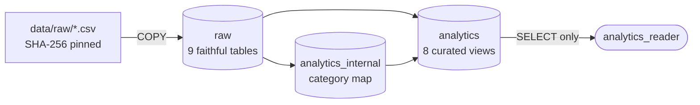

# Local database

A local PostgreSQL 16 container holds the Olist data for development and
integration tests. Version 16 matches the Aurora PostgreSQL target
([ADR 0001](adr/0001-database-platform.md)).

## First-time setup

```sh
cp .env.example .env          # then replace every change-me value
docker compose up -d --wait   # start Postgres and wait until healthy
cd backend
uv run python -m olist_nlsql.dbsetup download   # fetch + verify the dataset (~45 MB)
uv run python -m olist_nlsql.dbsetup build      # roles, raw data, analytics views (~5 s)
uv run pytest -m integration                    # ~170 tests against the database
```

`download` fetches the public Kaggle archive and checks every CSV against a pinned
SHA-256 ([dataset.py](../backend/src/olist_nlsql/dbsetup/dataset.py)). To reuse a copy
you already have, run `download --from-dir PATH`. The files land in `data/raw/`, which
is git-ignored. The dataset is CC BY-NC-SA 4.0 and is never committed.

## Everyday commands

Run from the repository root unless noted.

| Task | Command |
|---|---|
| Start | `docker compose up -d --wait` |
| Stop (keeps data) | `docker compose stop` |
| Status | `docker compose ps` |
| Logs | `docker compose logs -f postgres` |
| Reset everything | `docker compose down -v`, then `up -d --wait` and `dbsetup build` |
| Rebuild everything | `cd backend && uv run python -m olist_nlsql.dbsetup build` |
| Rebuild only views | `cd backend && uv run python -m olist_nlsql.dbsetup views` |
| Verify CSVs | `cd backend && uv run python -m olist_nlsql.dbsetup verify` |
| psql as superuser | `docker compose exec postgres psql -U postgres -d olist` |
| psql as the app role | `docker compose exec postgres psql -U analytics_reader -d olist` |

`build` is idempotent. It drops and recreates the `raw`, `analytics_internal` and
`analytics` schemas in one transaction, so a failed build leaves the previous state in
place. `views` rebuilds only the two analytics schemas, which is the fast loop when
editing [030_analytics_views.sql](../backend/src/olist_nlsql/dbsetup/sql/030_analytics_views.sql).

## Credentials and connections

| Variable (`.env`) | Used for |
|---|---|
| `POSTGRES_USER` / `POSTGRES_PASSWORD` | Container superuser. Bootstrap only: creates roles and database privileges. |
| `NLSQL_OWNER_PASSWORD` | `olist_owner`: owns the schemas, loads data, creates views. |
| `NLSQL_READER_PASSWORD` | `analytics_reader`: the read-only role the application uses. |
| `POSTGRES_HOST` / `POSTGRES_PORT` | Default `127.0.0.1:5432`. |

- The port is published on **127.0.0.1 only**, so the database isn't reachable from the
  network.
- Connections from the host need a password (scram-sha-256). `psql` inside the container
  uses the image's trusted local socket, which is fine for a dev container but isn't how
  the app connects.
- Use `127.0.0.1`, not `localhost`. On Windows `localhost` resolves to `::1` first, and
  because the port is bound to IPv4 only, each connection stalls for about two minutes.

## What `build` creates



| Step | File | Runs as |
|---|---|---|
| Roles, database privileges, reader session settings | [build.py](../backend/src/olist_nlsql/dbsetup/build.py) `bootstrap()` | superuser |
| Raw tables | [010_raw_tables.sql](../backend/src/olist_nlsql/dbsetup/sql/010_raw_tables.sql) | olist_owner |
| Bulk load + row-count check | `build.py` `_load_raw()` | olist_owner |
| Keys, foreign keys, indexes | [020_raw_constraints.sql](../backend/src/olist_nlsql/dbsetup/sql/020_raw_constraints.sql) | olist_owner |
| Analytics views | [030_analytics_views.sql](../backend/src/olist_nlsql/dbsetup/sql/030_analytics_views.sql) | olist_owner |
| Grants | [040_grants.sql](../backend/src/olist_nlsql/dbsetup/sql/040_grants.sql) | olist_owner |

## Roles

| Role | Can | Cannot |
|---|---|---|
| `olist_owner` | Own and change `raw`, `analytics_internal`, `analytics`; connect; create schemas in `olist` | Superuser actions, create roles or databases |
| `analytics_reader` | Connect to `olist`; `SELECT` on `analytics` views | Read `raw` or `analytics_internal`; any DML or DDL; temp tables; connect to `postgres`; grant access onward |

`analytics_reader` session defaults, set on the role:

| Setting | Value |
|---|---|
| `default_transaction_read_only` | `on` |
| `statement_timeout` | `10s` |
| `idle_in_transaction_session_timeout` | `30s` |
| `search_path` | `analytics` |
| Connection limit | 20 |

A session can override these settings itself (`SET statement_timeout`, or turning
read-only off). That's why privileges are the real boundary, and
[test_permissions.py](../backend/tests/integration/test_permissions.py) proves every write
still fails with read-only switched off. The SQL validator (Phase 2) will reject `SET`
statements outright.
