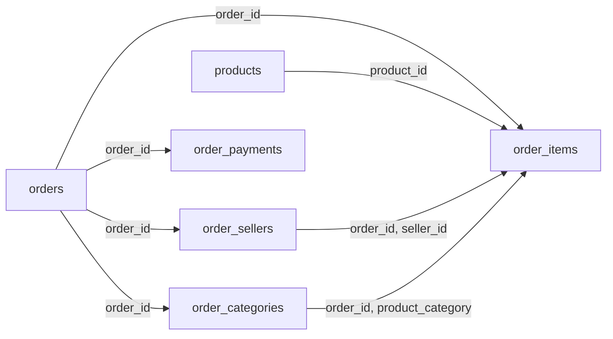

# SQL safety and semantic validation

Every SQL statement the model writes passes through
[`SqlValidator`](../backend/src/olist_nlsql/sqlsafety/validator.py) before it reaches
the database. The validator does two jobs:

1. **Defence in depth.** It rejects anything that isn't a single read-only SELECT over
   the approved analytics views.
2. **Analytical correctness.** It rejects SQL that is valid and safe but returns an
   inflated or mis-attributed business answer, especially **fan-out**: counting an
   order's revenue once per item.

Decisions: [ADR 0002](adr/0002-database-is-the-security-boundary.md) (the database is
the boundary), [ADR 0014](adr/0014-sql-validation-design.md) (validator design),
[ADR 0015](adr/0015-model-visible-relations.md) (which relations the model sees).

## Why the database role stays the security boundary

A validator is a program that parses a language it doesn't own. It can be wrong, and
sqlglot can disagree with PostgreSQL on an edge case. The database role
`analytics_reader` doesn't depend on the parser:
- SELECT on `analytics` only
- read-only by default
- a 10 s statement timeout
- no access to `raw`, `analytics_internal`, temp tables or the `postgres` database

[test_permissions.py](../backend/tests/integration/test_permissions.py) proves those
limits hold even with read-only mode turned off.
[test_validator_execution.py](../backend/tests/integration/test_validator_execution.py)
runs 18 of the validator's rejected attacks directly against the database, with the
validator bypassed, and the database refuses every one.

| Threat | Database role | Validator |
|---|:---:|:---:|
| Writes, DDL, GRANT, COPY | ✅ blocks | ✅ blocks |
| Reading `raw` / system catalogs | ✅ blocks | ✅ blocks |
| Long-running queries | ✅ 10 s timeout | ✅ join and size limits |
| `pg_sleep`, `set_config`, file functions | partly (timeout) | ✅ function allowlist |
| `SET`, transaction control | ❌ allowed by PostgreSQL | ✅ blocks |
| Fan-out (inflated totals) | ❌ not its job | ✅ `FANOUT_RISK` |
| Joins on wrong keys | ❌ | ✅ `INVALID_JOIN_PATH` |
| Lifetime totals ignoring a date filter | ❌ | ✅ hidden relations |

## Pipeline

Each stage fails closed. Stages 1–5 run on the parsed tree, stage 6 resolves every
column with `sqlglot.optimizer.qualify`, and stage 7 analyses sqlglot scopes.

| # | Stage | Rejects with |
|---|---|---|
| 1 | Size and parse: one PostgreSQL statement, at most 8,000 characters, no NUL bytes | `QUERY_TOO_LARGE`, `PARSE_ERROR`, `MULTIPLE_STATEMENTS` |
| 2 | Statement type: SELECT or UNION of SELECTs | `WRITE_OPERATION`, `UNSUPPORTED_CONSTRUCT` |
| 3 | Constructs: no write anywhere (including data-modifying CTEs), no `SELECT *`, no unsupported syntax, at most 6 joins | `WRITE_OPERATION`, `SELECT_STAR`, `UNSUPPORTED_CONSTRUCT`, `QUERY_TOO_LARGE` |
| 4 | Functions and casts: catalog allowlist only | `UNAPPROVED_FUNCTION`, `UNAPPROVED_SCHEMA` |
| 5 | Relations: `analytics` schema, exposed catalog relations only | `UNAPPROVED_SCHEMA`, `UNAPPROVED_RELATION` |
| 6 | Columns: each resolves to an exposed column | `UNAPPROVED_COLUMN`, `AMBIGUOUS_COLUMN` |
| 7 | Joins and grain: catalog relationships, no fan-out | `INVALID_JOIN_PATH`, `FANOUT_RISK` |
| 8 | Limits: LIMIT ≤ 1,000; adds `LIMIT 1001` when absent | `RESULT_LIMIT_EXCEEDED` |

After stage 8:
1. The SQL is **regenerated from the validated tree**: relations are schema-qualified,
   comments are dropped, and the output is pretty-printed.
2. It must **re-parse as exactly one SELECT**.

That returned SQL is the only thing ever executed.

The round trip is a real safeguard, not a formality. sqlglot regenerates `E'\\'` (one
backslash in PostgreSQL) as the unterminated string `e'\'`. The check catches this and
rejects the query instead of running something different from what was validated.

## What the validator guarantees

For every accepted query:
- It is exactly one SELECT (or UNION ALL/UNION of SELECTs) with no write, lock,
  `INTO`, `SET` or data-modifying CTE anywhere.
- It reads only exposed catalog relations in `analytics`, with no system catalogs.
- It references only exposed catalog columns.
- It calls only allowlisted functions and casts only to allowlisted types.
- Every join follows a catalog relationship key, and none is many-to-many or cartesian
  (except a CROSS JOIN with a single-row subquery).
- No duplicate-sensitive aggregate reads a source whose rows a join has multiplied.
- No attributed bridge outcome is aggregated without grouping by its attribution key.
- The result returns at most 1,000 rows, plus one row that signals truncation.

## What it does not guarantee

- **That the SQL answers the question.** A wrong filter, wrong metric or wrong period
  still passes. The benchmark (Phase 4) measures this.
- **Correctness of expressions the model invents.** `SUM(revenue) / COUNT(*)` passes,
  but it understates average order value. `AVG(revenue)` is correct.
- **Performance.** The statement timeout is the backstop.
- **Arbitrary PostgreSQL semantics.** Only the patterns below are modelled. Anything
  else is rejected rather than guessed at.

## Relationship graph

The joins the validator accepts. Each arrow is one-to-many, and the labels are the
join keys:



- Key pairs form **key domains**. All `order_id` columns are one domain, and so are
  `product_id`, `seller_id` and `product_category`.
- A join is accepted when every key pair is in one domain (or is the identical catalog
  column), and at least one side is unique on its join columns.
- Joining two many-sides, such as `order_items` with `order_payments`, is many-to-many
  and rejected.

## How grain analysis works

For every SELECT scope (including CTEs, derived tables and WHERE subqueries):

1. **Each source knows its unique keys and the lineage of its columns.**
   - A catalog relation is unique on its grain key.
   - A subquery with `GROUP BY k` is unique on `k`.
   - An aggregate subquery without GROUP BY is a single row.
   - A plain subquery keeps the keys of its non-duplicated sources.
2. **Joins are processed in order.**
   - If the joined side isn't unique on its join columns, the join is one-to-many and
     every earlier source becomes **duplicated**.
   - If the earlier side isn't unique, the joined side becomes duplicated.
   - If both sides can already have many rows per key, the join is rejected.
3. **Aggregates are checked against duplication.**
   - A duplicate-sensitive aggregate over a column of a duplicated source is
     `FANOUT_RISK`.
   - `COUNT(*)` is safe when at least one source isn't duplicated, because it then
     counts that source's rows.
   - `COUNT(DISTINCT x)`, `MIN` and `MAX` are always safe.
4. **Bridge attribution.** `order_sellers` and `order_categories` repeat each order's
   delivery and review outcome for every seller or category (ADR 0011). Aggregating
   those columns, or `COUNT(*)`, requires `GROUP BY seller_id` or
   `GROUP BY product_category`.
5. **Row-level output** with repeated values gets a warning, so the UI can say "don't
   add these up".

### Fan-out example

```sql
-- REJECTED: FANOUT_RISK
SELECT SUM(o.revenue)
FROM analytics.orders o
JOIN analytics.order_items i ON o.order_id = i.order_id;
```

> SUM(o.revenue) is computed after the one-to-many join to order_items on (order_id), so
> each orders value of o.revenue is repeated once per matching row and the result is
> inflated. Compute it from orders alone, or aggregate the many-side relation to one row
> per key in a subquery before joining.

Run anyway with the validator bypassed, this query returns more than 110% of true
revenue (tested). The safe rewrites:

```sql
-- ACCEPTED: revenue from orders alone
SELECT SUM(revenue) FROM analytics.orders;

-- ACCEPTED: pre-aggregate the many side, then join 1:1
SELECT o.customer_state, SUM(o.revenue) AS revenue, SUM(x.items) AS items
FROM orders o
JOIN (SELECT order_id, COUNT(*) AS items FROM order_items GROUP BY order_id) x
  ON x.order_id = o.order_id
GROUP BY 1;

-- ACCEPTED: the many side's own measure, or a DISTINCT count of the one side
SELECT i.product_category, SUM(i.revenue), COUNT(DISTINCT o.order_id)
FROM orders o JOIN order_items i ON o.order_id = i.order_id
GROUP BY 1;
```

### More fan-out and attribution rejections

| SQL | Why it's wrong |
|---|---|
| `SELECT SUM(o.revenue) FROM orders o JOIN order_payments p ON ...` | Revenue repeated per payment record |
| `SELECT AVG(o.review_score) FROM orders o JOIN order_items i ON ...` | Multi-item orders weigh more in the average |
| `... JOIN order_items i ... JOIN order_payments p ...` | Every item × payment pair; both sums inflated |
| `SELECT SUM(DISTINCT o.revenue) ... JOIN order_items ...` | DISTINCT drops equal values, not duplicate rows |
| `WITH x AS (SELECT o.revenue FROM orders o JOIN order_items i ...) SELECT SUM(revenue) FROM x` | Fan-out hidden in a CTE, detected through column lineage |
| `SELECT AVG(review_score) FROM order_sellers` | Each order counted once per seller |
| `SELECT customer_state, COUNT(*) FROM order_sellers GROUP BY 1` | Counts order-seller pairs, not orders |
| `WITH t AS (SELECT SUM(revenue) AS total FROM orders) SELECT SUM(t.total) FROM orders CROSS JOIN t` | The single total repeated on every row |

## Supported SQL

**Accepted constructs:**
- `SELECT` with column lists, expressions, aliases and `DISTINCT`
- `FROM` exposed relations, with or without the `analytics.` prefix
- `INNER JOIN` and `LEFT JOIN` with `ON` or `USING` on relationship keys (extra
  single-side filter predicates in `ON` are fine), and `CROSS JOIN` with a single-row
  subquery
- `WHERE`, `GROUP BY` (including ordinals), `HAVING`, `ORDER BY` (including
  `NULLS FIRST/LAST`), `LIMIT` and `OFFSET` as integer literals
- Non-recursive CTEs (they can't shadow catalog relation names), derived tables,
  scalar, `IN`, `ANY`, `EXISTS` and `NOT EXISTS` subqueries (correlated or not),
  `UNION` and `UNION ALL`
- Aggregates with `FILTER (WHERE ...)`, `PERCENTILE_CONT(...) WITHIN GROUP (ORDER BY ...)`,
  and window functions with `OVER (PARTITION BY ... ORDER BY ...)`
- `CASE`, `CAST` and `::` to allowed types, `IN` lists, `BETWEEN`, `LIKE`/`ILIKE`,
  `IS [NOT] NULL`, arithmetic, `||`, `DATE '...'` and `INTERVAL '...'` literals
- Comments, any keyword casing, and quoted identifiers (PostgreSQL case rules apply:
  `"Orders"` isn't `orders`)

**Rejected** (`UNSUPPORTED_CONSTRUCT` unless noted):
- `SELECT *` and `t.*` (`SELECT_STAR`)
- Recursive CTEs, `LATERAL`, `VALUES`, table functions (`generate_series`),
  `TABLESAMPLE`, `FETCH FIRST`, `DISTINCT ON`, `ROLLUP`/`CUBE`/`GROUPING SETS`,
  `INTERSECT`/`EXCEPT`
- `NATURAL`, `RIGHT` and `FULL` joins, comma joins, `ON true` (`INVALID_JOIN_PATH`),
  subqueries inside `ON`
- Query parameters (`$1`, `:name`), `LIMIT` expressions, and every non-SELECT statement

## Function allowlist

This list is defined in [catalog.yaml](../backend/src/olist_nlsql/catalog/catalog.yaml)
under `functions`. Names are matched on the PostgreSQL rendering of each call, so
`DATE_PART` counts as `EXTRACT` and `MEDIAN` as `PERCENTILE_CONT`.

| Kind | Functions |
|---|---|
| Aggregate, duplicate-sensitive | COUNT, SUM, AVG, STDDEV, PERCENTILE_CONT |
| Aggregate, duplicate-safe | MIN, MAX, BOOL_OR, BOOL_AND |
| Scalar | ROUND, COALESCE, NULLIF, DATE_TRUNC, EXTRACT, TO_CHAR, ABS, FLOOR, CEIL, GREATEST, LEAST, POWER, SQRT, LOWER, UPPER, INITCAP, LENGTH, TRIM, SUBSTRING, CONCAT, REPLACE, SPLIT_PART, POSITION |
| Window | ROW_NUMBER, RANK, DENSE_RANK, NTILE, LAG, LEAD, FIRST_VALUE, LAST_VALUE, PERCENT_RANK, CUME_DIST |

**Cast types:** numeric, integer, bigint, smallint, double precision, real, text,
varchar, date, timestamp, boolean, interval.

**Deliberately excluded:**
- `NOW()`, `CURRENT_DATE` and similar. The data ends in 2018, so "last 30 days" would
  silently return nothing, and the error explains that.
- Every system, session, file, network and sleep function: `pg_sleep`, `set_config`,
  `current_setting`, `pg_read_file`, `version`, `current_user`.
- Regex, JSON, array and `COLLATE` operators.
- `STRING_AGG` and `ARRAY_AGG`.

## Error codes

Codes are stable. Messages are written to be fed back to the model as repair
instructions in Phase 3.

| Code | Meaning |
|---|---|
| `PARSE_ERROR` | Not parseable PostgreSQL. Carries a location when available. |
| `MULTIPLE_STATEMENTS` | More than one statement |
| `WRITE_OPERATION` | DML, DDL, GRANT/REVOKE, COPY, CALL/DO, transaction or session control, `INTO`, `FOR UPDATE`, data-modifying CTE |
| `UNSUPPORTED_CONSTRUCT` | Valid SQL outside the supported subset, or anything the validator can't analyse |
| `SELECT_STAR` | `SELECT *` or `t.*` |
| `UNAPPROVED_SCHEMA` | Schema other than `analytics`, catalog-qualified names, schema-qualified functions |
| `UNAPPROVED_RELATION` | Unknown or hidden relation (the message names the alternative) |
| `UNAPPROVED_COLUMN` | Unknown or hidden column (the message suggests close matches) |
| `AMBIGUOUS_COLUMN` | Unqualified column present in several joined relations |
| `UNAPPROVED_FUNCTION` | Function, operator or cast type not in the allowlist |
| `INVALID_JOIN_PATH` | Join not on a catalog relationship, many-to-many, or cartesian |
| `FANOUT_RISK` | Aggregate over rows a join has multiplied, or an unattributed bridge outcome. Also a warning for row-level repetition. |
| `RESULT_LIMIT_EXCEEDED` | `LIMIT` above the configured maximum |
| `QUERY_TOO_LARGE` | SQL longer than `NLSQL_MAX_SQL_CHARS` or more joins than `NLSQL_MAX_JOINS` |

A result is a `ValidationResult` with these fields:

| Field | Contents |
|---|---|
| `status` | `accepted` or `rejected` |
| `sql` | The executable SQL, or None if rejected |
| `errors` / `warnings` | Each has a `code`, `message`, `details` and `location` |
| `limit_applied` | Whether the validator added a LIMIT |
| `relations` | The relations the query read |

## Limits

| Setting | Default | Env var |
|---|---:|---|
| Max result rows | 1,000 (hard ceiling) | `NLSQL_MAX_RESULT_ROWS` |
| Max SQL length | 8,000 characters | `NLSQL_MAX_SQL_CHARS` |
| Max joins | 6 | `NLSQL_MAX_JOINS` |
| Statement timeout | 10 s | Set on the `analytics_reader` role |

A LIMIT is only ever added to the outermost query. Inner subquery limits are left
alone, because changing them would change aggregate results.

## Known limitations

**It may reject legitimate SQL:**
- **Item-weighted averages of a one-side attribute.** `AVG(p.weight_g)` joined through
  `order_items` means "average weight of items sold", but it's rejected because the
  product rows are duplicated. Rewrite it as a grouped subquery or query `products`
  directly.
- **Bridge outcomes grouped by something other than the attribution key.** For example,
  an average review by *seller state* from `order_sellers`. The strictly correct form is
  a per-order subquery.
- **`SELECT DISTINCT` subqueries** are treated conservatively. Duplication flags survive
  the DISTINCT, even when the grain key is projected.
- **Joins with computed keys** (`LOWER(a) = b`), joins whose condition spans several
  earlier relations, and `RIGHT`/`FULL` joins.
- **Filtering a bridge to one seller** (`WHERE seller_id = 'x'`) makes outcomes valid,
  but only `GROUP BY` is recognised.
- **Anything sqlglot can't parse or regenerate faithfully**, such as some escape-string
  forms.

**Valid SQL that can still be wrong:**
- Wrong filters or periods: using `purchase_date` when delivery time was meant, or
  including the incomplete 2016 and 2018-09/10 months without a caveat (ADR 0013).
- Wrong population: `COUNT(*)` on `orders` includes canceled orders; delivered orders
  need `is_delivered`.
- Hand-built ratios: `SUM(revenue) / COUNT(*)` (use `AVG(revenue)`), or a late rate
  divided by all orders instead of `COUNT(is_late)`.
- Choosing `total_order_value` or `payment_value` when the question meant revenue, or
  the reverse.
- Mixing a per-seller outcome with order totals across two queries or a UNION.
- Top-N with ties, or `LIMIT` without `ORDER BY`.

## Tests

| Suite | What it proves |
|---|---|
| [sql_cases.py](../backend/tests/sql_cases.py) | 49 accepted and 132 rejected queries, each rejection with its expected code |
| [test_sql_validator.py](../backend/tests/unit/test_sql_validator.py) | The corpus; every error code covered; every catalog metric validates; every allowlisted function recognised by name; limits, output, messages, locations; fail-closed on internal errors |
| [test_validator_execution.py](../backend/tests/integration/test_validator_execution.py) | Every accepted query executes as `analytics_reader`; fan-out rejections return inflated numbers when run anyway; 18 attacks are also blocked by the database alone |
| [test_permissions.py](../backend/tests/integration/test_permissions.py) | The role holds even with read-only disabled and the validator bypassed |
